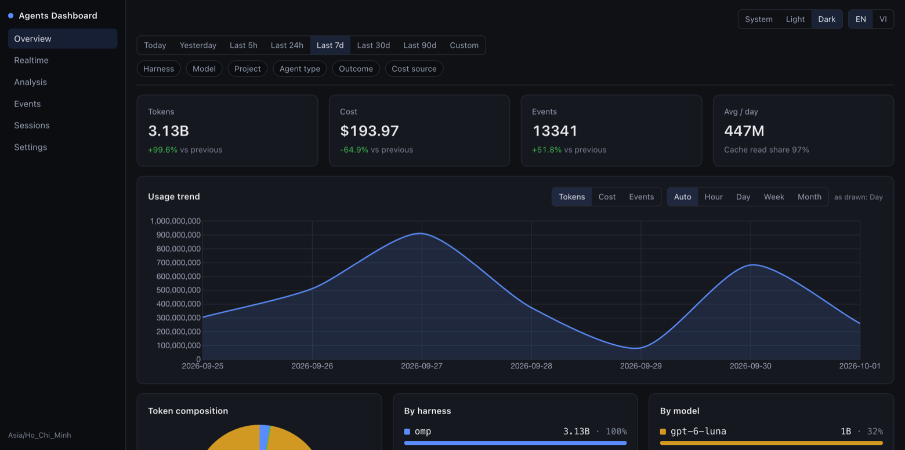
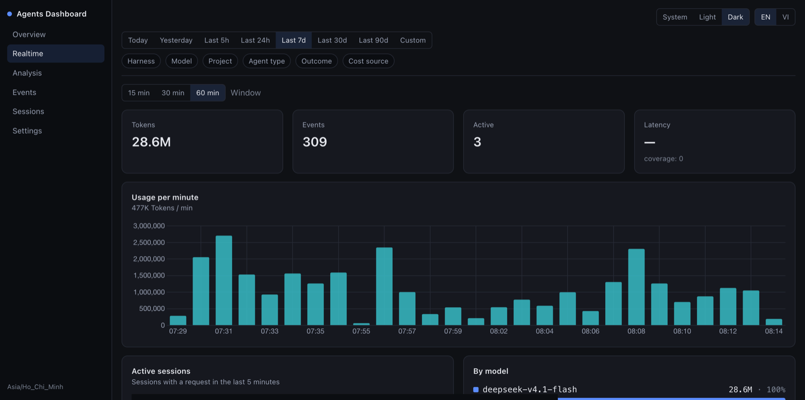
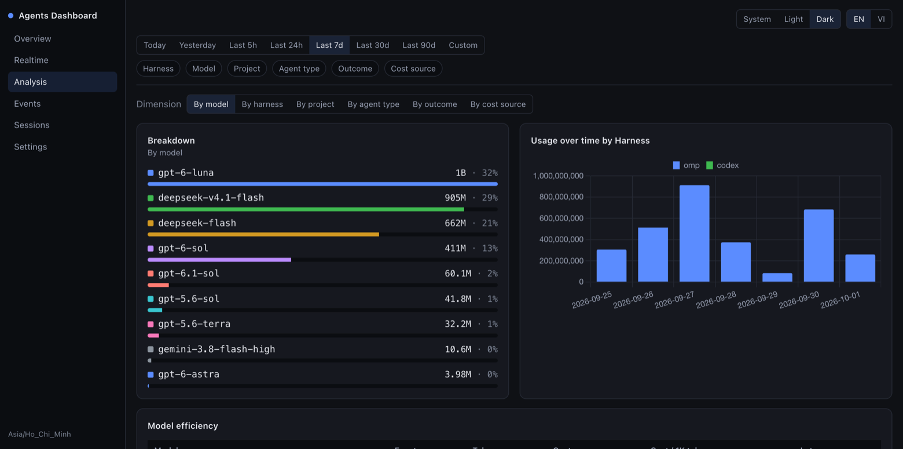
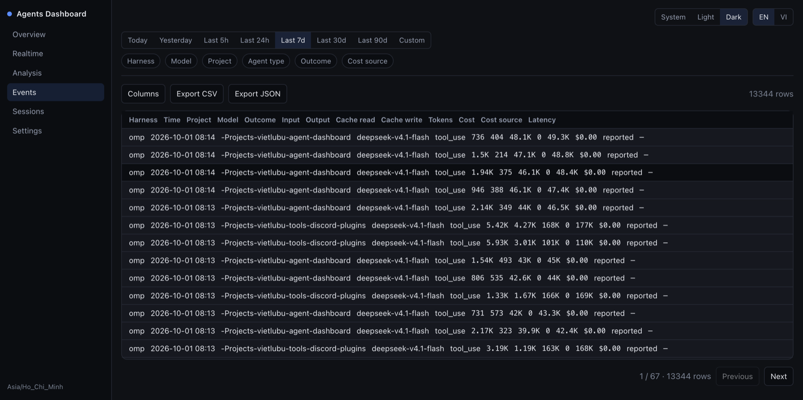
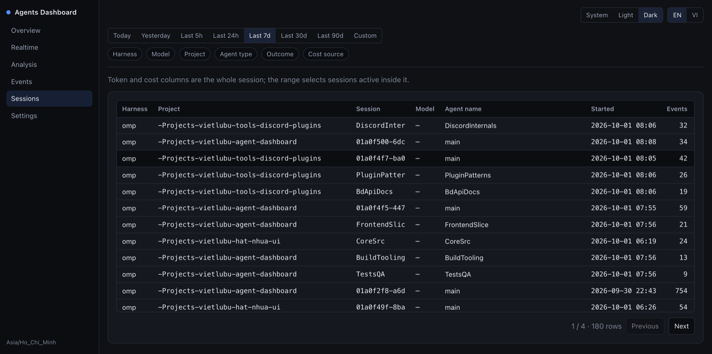
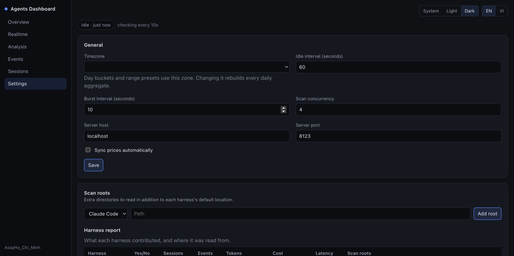

# Agents Dashboard

A local usage tracker for coding agents. It reads the session and telemetry files that
**Claude Code, Codex, OpenCode, Pi and omp** already write on your machine, normalizes them
into its own SQLite database, and serves a dashboard from that database.

One Go binary, two shapes: a native desktop window (Wails v3 webview) or — with
`-tags server` — a headless HTTP server serving the identical embedded frontend.



## What it does

- **Scans your own files.** No agent instrumentation, no proxy, no API key. Point it at a home
  directory and it reads what the agents already wrote.
- **Normalizes everything.** Tokens, cost, model, project, session, outcome — one schema no
  matter which agent produced the record.
- **Resolves cost.** The harness-reported cost wins; otherwise a price catalog is used
  (models.dev / LiteLLM). Unknown models are recorded as *unavailable*, never as `$0`.
- **Stays fast.** Incremental cursors per file, batched upserts, and precomputed daily /
  hourly / session rollups.

### Views

| View | What is on it |
|---|---|
| **Overview** | Token / cost / event KPIs with period-over-period deltas, usage trend, token composition, per-harness and per-model shares, activity heatmap |
| **Realtime** | Per-minute usage velocity over a 15/30/60-minute window, active sessions with a request in the last 5 minutes |
| **Analysis** | Period comparison, model efficiency, latency by harness, outcome breakdown, per-project table |
| **Events** | Raw normalized events, configurable columns, paginated |
| **Sessions** | Session table plus a detail panel that groups a session's events, models and projects |
| **Settings** | Timezone / locale / theme, scan roots, price rules and the resolved pricing table, data actions |

| Realtime | Analysis |
|---|---|
|  |  |

| Events | Sessions |
|---|---|
|  |  |



## Supported agents

| Harness | Read from |
|---|---|
| `claude` | `~/.claude/projects/**/*.jsonl` |
| `codex` | `~/.codex/sessions` + `~/.codex/state_5.sqlite` |
| `opencode` | `~/.local/share/opencode/opencode*.db` |
| `pi` | `~/.pi/agent/sessions` |
| `omp` | `~/.omp/stats.db` + `~/.omp/agent/sessions` |

Additional roots can be registered per harness in **Settings → Scan roots**; they are merged
with the built-in roots and de-duplicated. A root that does not exist yet is shown as the
expected location rather than an error.

## Privacy

The parsers JSON-decode into fixed whitelist structs. Prompt text, response text and tool
payloads are **never** read into memory, and nothing ever leaves the machine — the only
outbound requests are price-catalog downloads (disable with `AGENTS_DASHBOARD_AUTO_SYNC_PRICES=false`).

## Install & run

Requirements: **Go 1.26+**, **pnpm**, and the [`wails3`](https://v3.wails.io/) CLI on `PATH`.
Taskfile tasks can be invoked as `task <name>` or `wails3 task <name>`.

```bash
pnpm --dir frontend install

task dev             # desktop app in watch mode (vite on 127.0.0.1:9245, hot reload)
task build           # production desktop binary -> bin/agents-dashboard
task run             # build and launch

task build:server    # headless server binary -> bin/agents-dashboard-server
task run:server      # build and run the server
```

Cross-compilation uses the `GOOS` variable (dev mode is desktop-only):

```bash
task build GOOS=windows
task build GOOS=linux ARCH=arm64
```

### Headless / server mode

`bin/agents-dashboard-server` serves the same frontend over HTTP — no GUI dependencies.
Default `http://localhost:8080`:

```bash
AGENTS_DASHBOARD_SERVER_HOST=0.0.0.0 AGENTS_DASHBOARD_SERVER_PORT=8080 \
  ./bin/agents-dashboard-server
```

### Docker

```bash
task build:docker
docker run --rm -e AGENTS_DASHBOARD_SERVER_HOST=0.0.0.0 -p 8080:8080 agents-dashboard:latest
```

The image is a static, distroless build. Note the `SERVER_HOST` override: the default bind
address is `localhost`, so a plain `-p 8080:8080` mapping is not reachable from the host
without it.

## Configuration

Environment variables set process defaults; anything in **Settings** is persisted in the
database and overlays them without a restart.

| Variable | Default | Meaning |
|---|---|---|
| `AGENTS_DASHBOARD_HOME` | OS user config dir + `/agents-dashboard` | Data directory (database + log) |
| `AGENTS_DASHBOARD_TZ` | system zone | IANA timezone used for day bucketing |
| `AGENTS_DASHBOARD_IDLE_INTERVAL` | `60s` | Scan interval when idle |
| `AGENTS_DASHBOARD_BURST_INTERVAL` | `10s` | Scan interval while a session is active |
| `AGENTS_DASHBOARD_CONCURRENCY` | `NumCPU/2`, clamped to 2–4 | Parallel file scans |
| `AGENTS_DASHBOARD_SERVER_HOST` | `localhost` | HTTP bind host (server build) |
| `AGENTS_DASHBOARD_SERVER_PORT` | `8080` | HTTP bind port (server build) |
| `AGENTS_DASHBOARD_AUTO_SYNC_PRICES` | `true` | Download the price catalog at startup |

The database lives at `<AGENTS_DASHBOARD_HOME>/dashboard.db`, the log at
`<AGENTS_DASHBOARD_HOME>/agents-dashboard.log`. Delete both to start over — the next scan
rebuilds everything from the agent files.

## CLI scan report

```bash
go run ./cmd/scan-report            # per-harness table into a throwaway DB
go run ./cmd/scan-report -json      # machine-readable
go run ./cmd/scan-report -db ./tmp.db -home ~/.config/agents-dashboard
```

Useful to check what a harness actually exposes before trusting the dashboard: it scans into
a temporary database and prints the per-harness results.

## Architecture

```
main.go (composition root)
  └─ internal/service   Wails binding surface (JSON-only signatures)
       └─ internal/sync      scheduler + engine: scan loop, rollups, reporting
            ├─ internal/harness   per-agent adapters, file/DB parsing
            ├─ internal/pricing   cost resolution + catalog sync
            └─ internal/store     SQLite schema + every read/write path
       └─ internal/config        env defaults + mutable runtime config
internal/version                 build stamp
```

Scan flow: each adapter walks its roots newest-first, prefiltering lines by a byte marker
before JSON-decoding; every file keeps a `scan_state` cursor (`mtime,size,inode,offset,
watermark,parser_version`), so an unchanged file is skipped and a bumped parser version
forces a re-read. Events are upserted on `event_key` (the larger total wins), dirty days are
collected, and the rollups are refreshed once per harness. The UI updates by push, not
polling: `data:changed` bumps a version counter that refetches the live queries.

| Path | Purpose |
|---|---|
| `main.go`, `window_{desktop,server}.go` | Composition root; build-tagged window openers |
| `cmd/scan-report/` | Standalone scan report CLI |
| `internal/harness/` | One file per agent adapter + shared JSONL/SQLite sinks |
| `internal/store/` | Schema, DSN, queries, rollups, DTOs |
| `internal/sync/` | Engine, adaptive scheduler, reporting |
| `internal/service/` | Wails bindings (dashboard, events, meta, settings, sync) |
| `internal/pricing/` | Price catalog, catalog sync, model normalization |
| `frontend/src/api/` | The single seam over generated bindings |
| `frontend/src/views/`, `components/`, `stores/`, `composables/` | Vue 3 + TypeScript UI |
| `build/` | Wails Taskfiles per platform, icons, Dockerfiles, packaging |

## Development

```bash
go test ./...                            # full suite (~1.3s)
go test ./internal/store -run Rollup -v  # one package
pnpm --dir frontend build                # vue-tsc + vite build (type errors fail the build)
task common:generate:bindings            # regenerate frontend/bindings after changing a Go service type
```

`frontend/bindings/**` is committed but generated — never hand-edit it. The frontend has no
test suite; `vue-tsc` is its only automated check. Go tests use the stdlib `testing` package
with temp-dir fixtures. `internal/pricing/live_test.go` is the only network test and is
skipped under `-short` unless `AGENTS_DASHBOARD_LIVE_PRICING` is set.

## Notes

- Costs are estimates unless the harness reported one. Events whose model has no price carry
  a NULL cost and are excluded from totals, with a note in the UI rather than a silent zero.
- The scheduler scans continuously (idle and burst intervals); there is no daemon mode.
- macOS/Windows/Linux are all supported for both shapes; packaging targets live in `build/`.